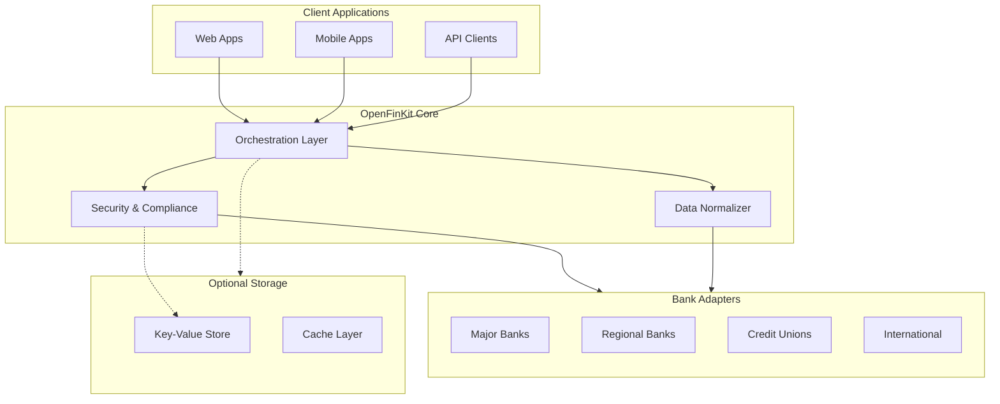

> [!WARNING]  
> This is a placeholder repo for exploring the idea and not the real project. Will likely create a new org and repo on GH for real work.

# **OpenFinKit (Working Title - Subject to Change)**

*An open-source, community-driven financial data aggregator for secure, transparent, and decentralized banking integrations.*

---

## **1. Introduction**

### Project Vision
OpenFinKit exists to **democratize access to banking and financial data** in an environment where no single solution can truly address the vast and diverse needs of the market. Our focus on openness, collaboration, and decentralized architecture reflects a belief that **financial technology should be both flexible and widely accessible**.

### Core Problem & Opportunity
- **Problem**: Current aggregator solutions are often proprietary, limiting coverage and creating potential lock-in. Smaller, regional institutions can be overlooked, while developers face opaque pricing and limited visibility into how data is accessed.  
- **Opportunity**: By embracing an **open, modular** library of reverse-engineered bank integrations, we can serve a far broader range of financial institutions. This decentralized approach fosters greater control and transparency—across everything from massive multinational banks to local credit unions.

---

## **2. Project Scope & Goals**

### What This Project **Is**:
- A **library of reverse-engineered adapters** for diverse financial institutions, from well-known global banks to regional credit unions.  
- A **secure orchestration layer** that manages session handling, credential encryption, and standardized data formats.  
- A **community-led** initiative that encourages forking, continuous improvement, and truly inclusive coverage.

### What This Project **Is Not**:
- A single, monolithic aggregator that dictates usage patterns—our model is meant to be decentralized, encouraging local or self-hosted deployments.  
- A replacement for legal or compliance expertise—each adopter must handle regulatory requirements per jurisdiction.

### Long-Term Vision
- **Decentralized Financial Access**: Reduce reliance on centralized services by enabling self-hosted adapters or community-operated nodes. 
- **Managed Offerings**: Provide straightforward hosting options for those who prefer a turnkey experience.
- **Broad Coverage**: Support institutions of every scale, recognizing that the largest players represent only a fraction of the real financial landscape.

---

## **3. Architecture Overview**

### High-Level Diagram



1. **Adapters**  
   - Reverse-engineered logic for login, data retrieval, and session handling specific to each institution.  
2. **Core Orchestrator**  
   - Coordinates requests, normalizes data, manages sessions, and routes calls across multiple adapters.  
3. **Security & Compliance Layer**  
   - Handles encryption of credentials, optional compliance hooks, and recommended security practices.  
4. **Potential Decentralized/Edge Deployment**  
   - Supports local or distributed hosting to avoid a single point of failure and to embrace flexibility.

### Technology Stack
- **Node.js/TypeScript** for broad accessibility among developers, with the possibility of expansion into other languages as the project grows.

### Potential Project Structure

```
openfinkit/
├── .github/
├── .changeset/
├── examples/
│   ├── react-app/
│   ├── cloudflare-api/
│   └── ...
├── packages/
│   ├── core/                    # Main orchestration package
│   │   ├── src/
│   │   └── package.json
│   ├── types/                   # Shared TypeScript types
│   │   ├── src/
│   │   └── package.json
│   ├── security/                # Security and encryption utilities
│   │   ├── src/
│   │   └── package.json
│   ├── adapters/               # Bank integration adapters
│   │   ├── chase/
│   │   ├── wells-fargo/
│   │   ├── bank-of-america/
│   │   └── credit-union-base/
│   ├── storage/                # Optional storage implementations
│   │   ├── src/
│   │   └── package.json
│   └── client/                 # Client SDK package
│       ├── src/
│       └── package.json
├── scripts/                    # Build and maintenance scripts
├── docs/                      # Documentation site
├── tests/                     # Integration tests
├── package.json
├── tsconfig.json
├── LICENSE
└── README.md
```

---
## **4. Reverse Engineering Approach**
> [!NOTE]  
> Not 100% sold on this approach just yet but seems likely to be the best way to go.

### Why Reverse Engineer?  
Many financial institutions lack modern APIs or only expose limited endpoints. Reverse engineering allows developers to integrate with a wide range of banks on **their own terms**, promoting freedom of choice and enabling access to the “long tail” of smaller institutions.

### Methodology (Very High-Level - more work needed to find concrete reverse engineering methods)


1. **Traffic Interception**: Tools like mitmproxy, Burp Suite, or Charles Proxy to observe real app traffic.  
2. **Dynamic Instrumentation**: Bypassing SSL pinning and dissecting runtime processes with frameworks like Frida or Objection.  
3. **Static Analysis**: Exploring decompiled mobile binaries (e.g., APKs) to uncover hidden endpoints or obfuscated request logic.

> **Note**: Always ensure you comply with local laws and bank terms, and prioritize user consent and data security.

---

## **5. Proposed Roadmap**

### MVP Milestones
- **Initial Adapters**: Major US banks plus at least one smaller/regional credit union to demonstrate feasibility.  
- **Core Orchestrator (Alpha)**: A Node.js library that standardizes login flows, fetches account/transaction data, and manages tokens.  
- **Security Framework**: Encrypted credential storage, recommended key management, and robust logging of authentication flows.

### Potential Features
- **Adaptive Testing**: Automated checks to highlight API changes or broken endpoints, prompting the community for quick fixes.  
- **Edge Deployments**: Guides and templates for running adapters on local proxies or serverless platforms.  
- **Global Coverage**: Collaborations with regional developer communities to add new institutions worldwide.

### Open Questions & Brainstorming
- **MFA & Security Challenges**: How to best handle multi-factor logins, push notifications, or rotating codes in a universal manner?  
- **Governance**: What model ensures sustainable maintenance without centralizing power?  
- **Compliance Add-Ons**: Should we package region-specific compliance modules (GDPR, PSD2) for enterprise usage?

---

## **6. Monetization Paths**

### Managed Hosting & Enterprise
- **SaaS Offering**: An optional hosted solution for businesses needing guaranteed uptime, support SLAs, and compliance reviews.  
- **Hybrid Models**: Users retain the open-source code while offloading maintenance and scaling to a commercial provider.

### Decentralized Services
- **Local & Regional Nodes**: Individuals or teams can host niche adapters, benefiting local communities or specialized financial workflows.

### Consulting & Professional Services (least likely - trying to get out of consulting business)
- **Integration & Customization**: Tailored solutions for enterprise customers or banks with unique security/compliance demands.  
- **Education & Workshops**: Teaching developers best practices in reverse engineering, open banking, and data handling.

---

## **7. Security & Compliance**

### Security Best Practices
- **Encryption of Credentials**: Strong encryption for stored secrets; recommend using external KMS for production setups.  
- **Transport Security**: All traffic should be HTTPS/TLS-secured, with strict no-logging of sensitive data in plaintext.  
- **Open Audits**: Encourage regular code and security reviews by the community or third-party experts.

### Data & Privacy
- Each implementer is responsible for complying with relevant data protection regulations (e.g., GDPR) and ensuring user consent.  
- We prioritize **user ownership** and **transparency** around how credentials and financial data are handled.

---

# Questions for Dax

## Community & Governance

- What have you found to be the most effective initial governance structure for  projects like this? Looking to learn from both what's worked and what hasn't in your experience.

- How do you typically approach contributor management in the early stages? Particularly interested in balancing quality with maintaining momentum.

- What strategies have worked well for sustaining long-term maintenance of less popular but critical components? This will be especially relevant for our regional bank adapters.

- Thinking about launch strategy and building initial momentum. What has worked best for attracting the right kind of attention and early contributors? Curious about everything from initial positioning to choice of launch platforms (Show HN, Reddit, Twitter/X, etc.).

- Beyond the launch, what have you found effective for maintaining consistent community growth and engagement? Particularly interested in how you've handled the transition from initial buzz to sustained contribution.

## Sustainability, Funding & Monetization

- I could potentially bootstrap this, but I'm unsure about the venture scaling potential. Given your experience with both bootstrapped and VC-backed open source projects, what signals should I be looking for to determine if this could be venture-scale?

- Evaluating funding models between Open Collective, GitHub Sponsors, and potential commercial approaches. Based on your experience with TypeScript ecosystem projects, what models have proven most sustainable? Any successful hybrid approaches?

- For monetization, we're considering:
  - Enterprise hosting/infrastructure (similar to Supabase's model)
  - Premium features for compliance/security
  - Support/maintenance contracts
  - Custom adapter development 
- Would love your thoughts on which of these might be most viable early on, or if you see other opportunities we're missing.

- How do you think about the sequencing of monetization? Should we focus on building the community first and monetize later, or try to get early commercial adoption? Particularly interested in how this might affect early architectural decisions.

- Looking at successful commercial open source in the TypeScript ecosystem (like Prisma, or your experience with [specific project]), how would you approach the balance between keeping core components open source while building sustainable commercial offerings? Particularly interested in your thoughts on packaging, licensing strategy, and where to draw the line between OSS and commercial features.

## Technical Architecture

- General thoughts on the proposed architecture?

- What patterns would you recommend for handling unstable upstream APIs like the ones we'll encounter with banks?

- How would you approach testing against real-world banking APIs that can change unexpectedly? Looking for practical strategies that won't overwhelm early contributors.

- Any feedback regarding the reverse engineering approach? Have you thought about any other ways to approach this?

## Growth Strategy

- Beyond standard documentation, what developer experience elements have you seen drive meaningful contribution in the TypeScript ecosystem?

- How would you approach building trust in an open source financial tool, especially in the early stages?

## Risk Management

- What's your perspective on managing legal risk while maintaining open source principles in the banking space?

- How would you structure security reviews and vulnerability management for a project of this nature?